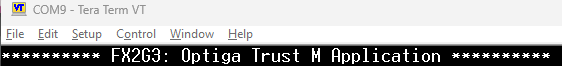

# EZ-USB&trade; FX2G3: OPTIGA&trade; Trust M application

This code example demonstrates the utilization and capabilities of the OPTIGA&trade; Trust M module – included on board with the EZ-USB&trade; FX2G3 kit – for implementing security features such as device authentication.


[View this README on GitHub.](https://github.com/Infineon/mtb-example-fx2g3-optiga-trust-m)

[Provide feedback on this code example.](https://cypress.co1.qualtrics.com/jfe/form/SV_1NTns53sK2yiljn?Q_EED=eyJVbmlxdWUgRG9jIElkIjoiQ0UyNDEwNzIiLCJTcGVjIE51bWJlciI6IjAwMi00MTA3MiIsIkRvYyBUaXRsZSI6IkVaLVVTQiZ0cmFkZTsgRlgyRzM6IE9QVElHQSZ0cmFkZTsgVHJ1c3QgTSBhcHBsaWNhdGlvbiIsInJpZCI6InN1a3UiLCJEb2MgdmVyc2lvbiI6IjEuMC4xIiwiRG9jIExhbmd1YWdlIjoiRW5nbGlzaCIsIkRvYyBEaXZpc2lvbiI6Ik1DRCIsIkRvYyBCVSI6IldJUkVEIiwiRG9jIEZhbWlseSI6IkhTTFNfVVNCIn0=)


## Requirements


- [ModusToolbox&trade;](https://www.infineon.com/modustoolbox) v3.5 or later (tested with v3.5)
- Board support package (BSP) minimum required version: 4.3.3
- Programming language: C
- Associated parts: [EZ-USB&trade; FX2G3](https://www.infineon.com/cms/en/product/promopages/ez-usb-fx2g3/)


## Supported toolchains (make variable 'TOOLCHAIN')

- GNU Arm&reg; Embedded Compiler v14.2.1 (`GCC_ARM`) – Default value of `TOOLCHAIN`
- Arm&reg; Compiler v6.22 (`ARM`)


## Supported kits (make variable 'TARGET')

- [EZ-USB&trade; FX2G3 DVK](https://www.infineon.com/cms/en/product/promopages/ez-usb-fx2g3/) (`KIT_FX2G3_104LGA`) – Default value of `TARGET`


## Hardware setup

This example uses the board's default configuration. See the kit user guide to ensure that the board is configured correctly.


## Software setup

See the [ModusToolbox&trade; tools package installation guide](https://www.infineon.com/ModusToolboxInstallguide) for information about installing and configuring the tools package.

Install a terminal emulator if you do not have one. Instructions in this document use [Tera Term](https://teratermproject.github.io/index-en.html).

Install the **EZ-USB&trade; FX Control Center** (Alpha) application from [Infineon Developer Center](https://softwaretools.infineon.com/tools/com.ifx.tb.tool.ezusbfxcontrolcenter).


### Optional software

[EZ-USB&trade; GPIF III Designer](https://softwaretools.infineon.com/tools/com.ifx.tb.tool.ezusbgpifiiidesigner) - EZ-USB&trade; GPIF III Designer, a desktop application that guides the process of defining general programmable interface and state machine to generate C source header for FX device family.


## Using the code example


### Create the project

The ModusToolbox&trade; tools package provides the Project Creator as both a GUI tool and a command line tool.

<details><summary><b>Use Project Creator GUI</b></summary>

1. Open the Project Creator GUI tool

   There are several ways to do this, including launching it from the dashboard or from inside the Eclipse IDE. For more details, see the [Project Creator user guide](https://www.infineon.com/ModusToolboxProjectCreator) (locally available at *{ModusToolbox&trade; install directory}/tools_{version}/project-creator/docs/project-creator.pdf*)

2. On the **Choose Board Support Package (BSP)** page, select a kit supported by this code example. See [Supported kits](#supported-kits-make-variable-target)

   > **Note:** To use this code example for a kit not listed here, you may need to update the source files. If the kit does not have the required resources, the application may not work

3. On the **Select Application** page:

   a. Select the **Applications(s) Root Path** and the **Target IDE**

      > **Note:** Depending on how you open the Project Creator tool, these fields may be pre-selected for you

   b. Select this code example from the list by enabling its check box

      > **Note:** You can narrow the list of displayed examples by typing in the filter box

   c. (Optional) Change the suggested **New Application Name** and **New BSP Name**

   d. Click **Create** to complete the application creation process

</details>


<details><summary><b>Use Project Creator CLI</b></summary>

The 'project-creator-cli' tool can be used to create applications from a CLI terminal or from within batch files or shell scripts. This tool is available in the *{ModusToolbox&trade; install directory}/tools_{version}/project-creator/* directory.

Use a CLI terminal to invoke the 'project-creator-cli' tool. On Windows, use the command-line 'modus-shell' program provided in the ModusToolbox&trade; installation instead of a standard Windows command-line application. This shell provides access to all ModusToolbox&trade; tools. You can access it by typing "modus-shell" in the search box in the Windows menu. In Linux and macOS, you can use any terminal application.

The following example clones the "[EZ-USB&trade; FX2G3: Optiga Trust M application](https://github.com/Infineon/mtb-example-fx2g3-optiga-trust-m)" application with the desired name "FX2G3_Optiga_Trust_M" configured for the *KIT_FX2G3_104LGA* BSP into the specified working directory, *C:/mtb_projects*:

   ```
   project-creator-cli --board-id KIT_FX2G3_104LGA --app-id mtb-example-fx2g3-optiga-trust-m --user-app-name FX2G3_Optiga_Trust_M --target-dir "C:/mtb_projects"
   ```

The 'project-creator-cli' tool has the following arguments:

Argument | Description | Required/optional
---------|-------------|-----------
`--board-id` | Defined in the <id> field of the [BSP](https://github.com/Infineon?q=bsp-manifest&type=&language=&sort=) manifest | Required
`--app-id`   | Defined in the <id> field of the [CE](https://github.com/Infineon?q=ce-manifest&type=&language=&sort=) manifest | Required
`--target-dir`| Specify the directory in which the application is to be created if you prefer not to use the default current working directory | Optional
`--user-app-name`| Specify the name of the application if you prefer to have a name other than the example's default name | Optional

<br>

> **Note:** The project-creator-cli tool uses the `git clone` and `make getlibs` commands to fetch the repository and import the required libraries. For details, see the "Project creator tools" section of the [ModusToolbox&trade; tools package user guide](https://www.infineon.com/ModusToolboxUserGuide) (locally available at {ModusToolbox&trade; install directory}/docs_{version}/mtb_user_guide.pdf).

</details>


### Open the project

After the project has been created, you can open it in your preferred development environment.


<details><summary><b>Eclipse IDE</b></summary>

If you opened the Project Creator tool from the included Eclipse IDE, the project will open in Eclipse automatically.

For more details, see the [Eclipse IDE for ModusToolbox&trade; user guide](https://www.infineon.com/MTBEclipseIDEUserGuide) (locally available at *{ModusToolbox&trade; install directory}/docs_{version}/mt_ide_user_guide.pdf*).

</details>


<details><summary><b>Visual Studio (VS) Code</b></summary>

Launch VS Code manually, and then open the generated *{project-name}.code-workspace* file located in the project directory.

For more details, see the [Visual Studio Code for ModusToolbox&trade; user guide](https://www.infineon.com/MTBVSCodeUserGuide) (locally available at *{ModusToolbox&trade; install directory}/docs_{version}/mt_vscode_user_guide.pdf*).

</details>


<details><summary><b>Command line</b></summary>

If you prefer to use the CLI, open the appropriate terminal, and navigate to the project directory. On Windows, use the command-line 'modus-shell' program; on Linux and macOS, you can use any terminal application. From there, you can run various `make` commands.

For more details, see the [ModusToolbox&trade; tools package user guide](https://www.infineon.com/ModusToolboxUserGuide) (locally available at *{ModusToolbox&trade; install directory}/docs_{version}/mtb_user_guide.pdf*).

</details>


### Using this code example with specific products

By default, the code example builds for the `CYUSB2318-BF104AXI` product.


#### List of supported products

- `CYUSB2318-BF104AXI`

- `CYUSB2317-BF104AXI`

- `CYUSB2316-BF104AXI`

- `CYUSB2315-BF104AXI`


#### Setup for a different product

Perform the following steps to build this code example for a different, supported product:

1. Launch the BSP assistant tool:

   a. **Eclipse IDE:** Launch the **BSP Assistant** tool by navigating to **Quick Panel** > **Tools**

   b. **Visual Studio Code:** Select the ModusToolbox&trade; extension from the menu bar, and launch the **BSP Assistant** tool, available in the **Application** menu of the **MODUSTOOLBOX TOOLS** section from the left pane

2. In **BSP Assistant**, select **Devices** from the tree view on the left

3. Choose `CYUSB231x-BF104AXI` from the drop-down menu, on the right

4. Click **Save**

   This closes the **BSP Assistant** tool.

5. Navigate the project with the IDE's **Explorer** and delete the *GeneratedSource* folder (if available) at *`<bsp-root-folder>`/bsps/TARGET_APP_KIT_FX2G3_104LGA/config*

   > **Note:** For products `CYUSB2315-BF104AXI` and `CYUSB2316-BF104AXI`, additionally delete the `*.cyqspi` file from the config/ directory

6. Launch the **Device Configurator** tool

   a. **Eclipse IDE:** Select your project in the project explorer, and launch the **Device Configurator** tool by navigating to **Quick Panel** > **Tools**

   b. **Visual Studio Code:** Select the ModusToolbox&trade; extension from the left menu bar, and launch the **Device Configurator** tool, available in the **BSP** menu of the **MODUSTOOLBOX TOOLS** section from the left pane

7. Correct the issues (if any) specified in the **Errors** section on the bottom

   a. For a switch from the `CYUSB2318-BF104AXI` product to any other, a new upper limit of 100 MHz is imposed on the desired frequency that can originate from the PLL. Select this issue and change the desired frequency from 150 MHz to 75 MHz

   b. The `CLK_PERI` clock, which is derived from this new source frequency, is also affected. To restore it to its original frequency, go to the **System Clocks** tab, select `CLK_PERI`, and set its divider to '1' (instead of '2')


> **Note:** For the `CYUSB2315-BF104AXI` product, to enable UART logging through SCB, follow the steps below:<br>
a. Set the `USBFS_LOGS_ENABLE` macro to `0` in the **Makefile**<br>
b. In **main.c**, modify the SCB configuration by changing `LOGGING_SCB` from `(SCB4)` to `(SCB0)`, `LOGGING_SCB_IDX` from `(4)` to `(0)` and the value of `dbgCfg.dbgIntfce` from `CY_DEBUG_INTFCE_UART_SCB4` to `CY_DEBUG_INTFCE_UART_SCB0`<br>
c. Launch the Device Configurator tool to disable `SCB4`, and enable `SCB0` for UART. Set `921600` baud, `9` Oversample, and use the `16 bit Divider 0 clk` clock


## Operation

**Note:** This code example currently supports Windows hosts. Support for Linux and macOS will be added in upcoming releases.

1. Connect the board (J2) to your PC using the provided USB cable

2. Connect the USBFS port (J7) on the board to the PC for debug logs

3. Open a terminal program and select the Serial COM port. Set the serial port parameters to 8N1 and 921600 baud

4. Follow these steps to program the board using the [**EZ-USB&trade; FX Control Center**](https://softwaretools.infineon.com/tools/com.ifx.tb.tool.ezusbfxcontrolcenter) (Alpha) application

   1. Perform the following steps to enter into the **Bootloader** mode:

      a. Press and hold the **PMODE** (**SW1**) switch<br>
      b. Press and release the **RESET** switch<br>
      c. Release the **PMODE** switch<br>

   2. Open **EZ-USB&trade; FX Control Center** application
      The **EZ-USB&trade; FX2G3** device displays as **EZ-USB&trade; FX BOOTLOADER**
      
   3. Select the **EZ-USB&trade; FX BOOTLOADER** device in **EZ-USB&trade; FX Control Center** 

   4. Navigate to **Program** > **Internal Flash**

   5. Navigate to the *<CE Title>/build/APP_KIT_FX2G3_104LGA/Release* folder within the CE directory and locate the *.hex* file and program

   6. Confirm if the programming is successful in the log window of the **EZ-USB&trade; FX Control Center** application
   
5. After programming, the application starts automatically. Confirm that the following title is displayed on the UART terminal:

   **Figure 1. Terminal output on program startup**

   


## Debugging

By default, the USBFS port is enabled for debug logs.

To enable debug logs on UART, set the **USBFS_LOGS_ENABLE** compiler flag to '0u' in the *Makefile* file. SCB4 of the EZ-USB&trade; FX2G3 device is used as UART with a baud rate of 921,600 to send out log messages through the P11.0 pin.

Debug the code example by setting debug levels for the UART logs. Set the `DEBUG_LEVEL` macro in the *main.c* file with the following values for debugging:

**Table 1. Debug values**

 Macro value  | Description
 :--------    | :-------------
 1u           | Enable only error messages
 2u           | Enable error and warning messages
 3u           | Enable error, warning, and info messages
 4u           | Enable all message types
<br>


## Design and implementation

The OPTIGA&trade; Trust M security module is included on board with the EZ-USB&trade; FX2G3 development kit. Communications between EZ-USB&trade; FX2G3 and the OPTIGA&trade; module are performed over I2C. The OPTIGA&trade; module is available at the I2C address defined by the [`OPTIGA_FX_ADDR`](./COMPONENT_OPTIGA_CYHAL/fx_pal_include/pal_custom.h#L17) macro. SDA and SCL lines are connected with the module, while RST and VDD are unavailable. To perform a reset without the RST pin, use the soft reset capability.

The EZ-USB&trade; FX2G3 device controls the OPTIGA&trade; module via the OPTIGA&trade; Trust M host library. This library is configured through the [optiga_lib_config_mtb.h](./optiga_lib_config_mtb.h) config header. The [*COMPONENT_OPTIGA_CYHAL*](./COMPONENT_OPTIGA_CYHAL/) directory contains the  implementation of the peripheral abstraction layer (PAL), which is used by the OPTIGA&trade; Trust M host library to utilize FX2G3 for features such as I2C, timers, memory allocation, and more.


### Features of the application

The application authenticates the OPTIGA&trade; module from the EZ-USB&trade; FX2G3 device. You can expand it to enable host and device authentication. The application uses the following features:

- Communication with the OPTIGA&trade; module is performed over I2C
- The application uses a key store on the OPTIGA&trade; module that holds a private key for at least the duration of the application, with the ability to retrieve the corresponding public key based on the key store ID
- ECC NIST P 256 curve is used for key pair generation
- ECDSA-based digital signing and sign verification are performed accordingly


### Application workflow

1. The FX2G3 initializes the I2C lines to communicate with the OPTIGA&trade; module

2. An initialization command is then sent to the OPTIGA&trade; module

3. Upon initialization, the application sends requests to generate a key pair. The OPTIGA&trade; module stores its private key in the key store with the `OPTIGA_FREE_ECC_KEY_ID` ID (set to `0xE0F2` in this application) and exports its public key to EZ-USB&trade; FX2G3

4. FX2G3 sends a digest to OPTIGA&trade; which is then signed with the public key

5. The signature is sent to OPTIGA&trade; and verified against the private key from the key store with the `OPTIGA_FREE_ECC_KEY_ID` ID


## Compile-time configurations

This application's functionality can be customized by setting variables in *Makefile* or by configuring them through `make` CLI arguments.

- Run the `make build` command or build the project in your IDE to compile the application and generate a USB bootloader-compatible binary. This binary can be programmed onto the EZ-USB&trade; FX2G3 device using the **EZ-USB&trade; FX Control Center** application

- Run the `make build CORE=CM0P` command or set the variable in *Makefile* to compile and generate the binary for the Cortex&reg; M0+ core. By default, `CORE` is set as `CM4` and the binary is compiled and generated for the Cortex&reg; M4 core

- Choose between the **Arm&reg; Compiler** or the **GNU Arm&reg; Embedded Compiler** build toolchains by setting the `TOOLCHAIN` variable in *Makefile* to `ARM` or `GCC_ARM` respectively. If you set it to `ARM`, ensure to set `CY_ARM_COMPILER_DIR` as a make variable or environment variable, pointing to the path of the compiler's root directory

Additional settings can be configured through macros specified by the `DEFINES` variable in *Makefile*:

**Table 2. Macro description**

Flag name                           | Description                                      | Allowed values
:-------------                      | :----------                                      | :--------------
DEBUG_INFRA_EN                      | Enable debug logging infrastructure              | 1u to enable debug logs <br> 0u to disable debug logs
USBFS_LOGS_ENABLE                   | Enable debug logs through USBFS port             | 1u for debug logs over USBFS <br> 0u for debug logs over UART (SCB4)
OPTIGA_LIB_EXTERNAL                 | Pick the OPTIGA&trade; middleware config header  | optiga_lib_config_mtb.h
OPTIGA_INIT_DEINIT_DONE_EXCLUSIVELY | init/deinit managed by application               | 1u to use application-level init/deinit <br> 0u to use middleware operation-level init/deinit
<br>


## Application files

**Table 3. Application file description**
File           | Description   
:------------- | :------------                         
*optiga_app.c* | C source file implementing the OPTIGA&trade; init/deinit and application logic
*optiga_app.h* | Header file for application macros and function declarations
*usb_i2c.c*    | C source file with I2C handlers
*usb_i2c.h*    | Header file with the I2C application constants and function definitions
*cm0_code.c*   | CM0 initialization code
*main.c*       | C source for I2C interface and device initialization, and application launch
*Makefile*     | GNU make compliant build script for compiling this example
<br>


## Related resources

Resources  | Links
-----------|----------------------------------
User guide | [EZ-USB&trade; FX2G3 SDK user guide](./docs/EZ-USB-FX2G3-SDK-User-Guide.pdf)
Code examples  | [Using ModusToolbox&trade;](https://github.com/Infineon/Code-Examples-for-ModusToolbox-Software) on GitHub
Device documentation | [EZ-USB&trade; FX2G3 datasheets](https://www.infineon.com/cms/en/product/promopages/ez-usb-fx2g3/#!?fileId=8ac78c8c90530b3a01909c03f29537e0)
Development kits | Select your kits from the [Evaluation board finder](https://www.infineon.com/cms/en/design-support/finder-selection-tools/product-finder/evaluation-board)
Libraries on GitHub | [mtb-pdl-cat1](https://github.com/Infineon/mtb-pdl-cat1) – Peripheral Driver Library (PDL) and documents
Middleware on GitHub  | [usbfxstack](https://github.com/Infineon/usbfxstack) – USBFXStack middleware library and documents
Tools  | [ModusToolbox&trade;](https://www.infineon.com/modustoolbox) – ModusToolbox&trade; software is a collection of easy-to-use libraries and tools enabling rapid development with Infineon MCUs for applications ranging from wireless and cloud-connected systems, edge AI/ML, embedded sense and control, to wired USB connectivity using PSOC&trade; Industrial/IoT MCUs, AIROC&trade; Wi-Fi and Bluetooth&reg; connectivity devices, XMC&trade; Industrial MCUs, and EZ-USB&trade;/EZ-PD&trade; wired connectivity controllers. ModusToolbox&trade; incorporates a comprehensive set of BSPs, HAL, libraries, configuration tools, and provides support for industry-standard IDEs to fast-track your embedded application development
<br>

### Compatibility information:
* This code example uses the PDL layer for direct communication with device peripherals, without relying on HAL peripheral APIs
* This code example relies on the USBFXStack middleware library for USBFS and does not support USBFS through the USB Device Middleware Library


## Other resources

Infineon provides a wealth of data at [www.infineon.com](https://www.infineon.com) to help you select the right device, and quickly and effectively integrate it into your design.


## Document history


Document title: *CE241072* – *EZ-USB&trade; FX2G3: OPTIGA&trade; Trust M application*

 Version | Description of change
 ------- | ---------------------
 1.0.0   | New code example
 1.0.1   | Updated to use the example with other products
<br>


All referenced product or service names and trademarks are the property of their respective owners.

The Bluetooth&reg; word mark and logos are registered trademarks owned by Bluetooth SIG, Inc., and any use of such marks by Infineon is under license.

PSOC&trade;, formerly known as PSoC&trade;, is a trademark of Infineon Technologies. Any references to PSoC&trade; in this document or others shall be deemed to refer to PSOC&trade;.

---------------------------------------------------------

© Cypress Semiconductor Corporation, 2025. This document is the property of Cypress Semiconductor Corporation, an Infineon Technologies company, and its affiliates ("Cypress").  This document, including any software or firmware included or referenced in this document ("Software"), is owned by Cypress under the intellectual property laws and treaties of the United States and other countries worldwide.  Cypress reserves all rights under such laws and treaties and does not, except as specifically stated in this paragraph, grant any license under its patents, copyrights, trademarks, or other intellectual property rights.  If the Software is not accompanied by a license agreement and you do not otherwise have a written agreement with Cypress governing the use of the Software, then Cypress hereby grants you a personal, non-exclusive, nontransferable license (without the right to sublicense) (1) under its copyright rights in the Software (a) for Software provided in source code form, to modify and reproduce the Software solely for use with Cypress hardware products, only internally within your organization, and (b) to distribute the Software in binary code form externally to end users (either directly or indirectly through resellers and distributors), solely for use on Cypress hardware product units, and (2) under those claims of Cypress's patents that are infringed by the Software (as provided by Cypress, unmodified) to make, use, distribute, and import the Software solely for use with Cypress hardware products.  Any other use, reproduction, modification, translation, or compilation of the Software is prohibited.
<br>
TO THE EXTENT PERMITTED BY APPLICABLE LAW, CYPRESS MAKES NO WARRANTY OF ANY KIND, EXPRESS OR IMPLIED, WITH REGARD TO THIS DOCUMENT OR ANY SOFTWARE OR ACCOMPANYING HARDWARE, INCLUDING, BUT NOT LIMITED TO, THE IMPLIED WARRANTIES OF MERCHANTABILITY AND FITNESS FOR A PARTICULAR PURPOSE.  No computing device can be absolutely secure.  Therefore, despite security measures implemented in Cypress hardware or software products, Cypress shall have no liability arising out of any security breach, such as unauthorized access to or use of a Cypress product. CYPRESS DOES NOT REPRESENT, WARRANT, OR GUARANTEE THAT CYPRESS PRODUCTS, OR SYSTEMS CREATED USING CYPRESS PRODUCTS, WILL BE FREE FROM CORRUPTION, ATTACK, VIRUSES, INTERFERENCE, HACKING, DATA LOSS OR THEFT, OR OTHER SECURITY INTRUSION (collectively, "Security Breach").  Cypress disclaims any liability relating to any Security Breach, and you shall and hereby do release Cypress from any claim, damage, or other liability arising from any Security Breach.  In addition, the products described in these materials may contain design defects or errors known as errata which may cause the product to deviate from published specifications. To the extent permitted by applicable law, Cypress reserves the right to make changes to this document without further notice. Cypress does not assume any liability arising out of the application or use of any product or circuit described in this document. Any information provided in this document, including any sample design information or programming code, is provided only for reference purposes.  It is the responsibility of the user of this document to properly design, program, and test the functionality and safety of any application made of this information and any resulting product.  "High-Risk Device" means any device or system whose failure could cause personal injury, death, or property damage.  Examples of High-Risk Devices are weapons, nuclear installations, surgical implants, and other medical devices.  "Critical Component" means any component of a High-Risk Device whose failure to perform can be reasonably expected to cause, directly or indirectly, the failure of the High-Risk Device, or to affect its safety or effectiveness.  Cypress is not liable, in whole or in part, and you shall and hereby do release Cypress from any claim, damage, or other liability arising from any use of a Cypress product as a Critical Component in a High-Risk Device. You shall indemnify and hold Cypress, including its affiliates, and its directors, officers, employees, agents, distributors, and assigns harmless from and against all claims, costs, damages, and expenses, arising out of any claim, including claims for product liability, personal injury or death, or property damage arising from any use of a Cypress product as a Critical Component in a High-Risk Device. Cypress products are not intended or authorized for use as a Critical Component in any High-Risk Device except to the limited extent that (i) Cypress's published data sheet for the product explicitly states Cypress has qualified the product for use in a specific High-Risk Device, or (ii) Cypress has given you advance written authorization to use the product as a Critical Component in the specific High-Risk Device and you have signed a separate indemnification agreement.
<br>
Cypress, the Cypress logo, and combinations thereof, ModusToolbox, PSoC, CAPSENSE, EZ-USB, F-RAM, and TRAVEO are trademarks or registered trademarks of Cypress or a subsidiary of Cypress in the United States or in other countries. For a more complete list of Cypress trademarks, visit www.infineon.com. Other names and brands may be claimed as property of their respective owners.
